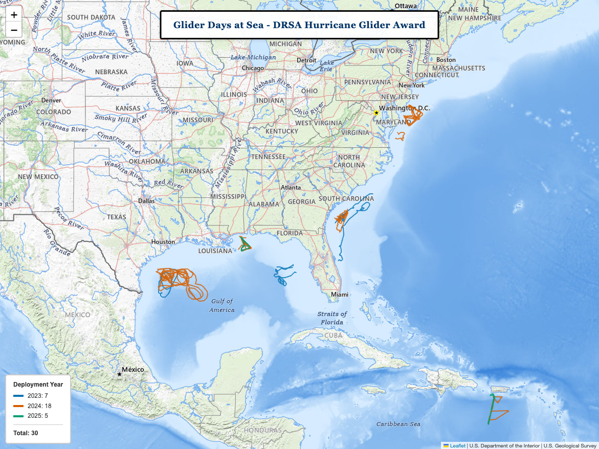
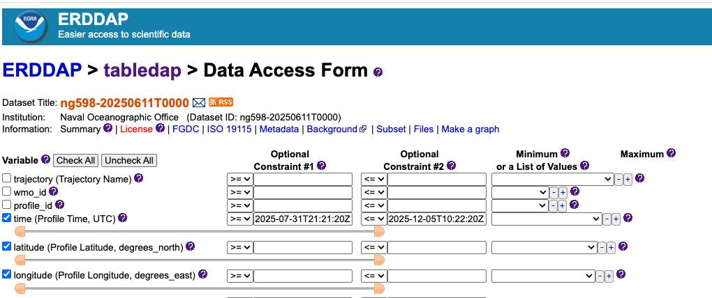

# GDAMM - GDAC Automated Map Maker

A command-line tool for visualizing autonomous underwater vehicle (glider)
deployment tracks on interactive Leaflet maps. Designed for publication-quality
output with PNG export capability.



## Features

- Import glider deployment data from GeoJSON files
- Bulk import from directory trees
- Interactive Leaflet map with USGS Topo basemap
- Colorblind-friendly palette (Wong, 2011) for year-based track coloring
- Dynamic color assignment for any year in the dataset
- Optional start/end markers to distinguish overlapping tracks
- Optional title banner for presentations
- Deployment counts per year in legend
- Save to PNG button for publication-ready images
- DuckDB backend for efficient data storage

## Installation

```bash
pip install duckdb folium colorama
```

## Usage

### Import GeoJSON Data

```bash
# Single file
python gdamm_gdac.py --data-file data/<region>/<year>/<file>.json \
                      --db data/db/gliders.db

# Bulk import (walks directory tree)
python gdamm_gdac.py --data-dir data --db data/db/gliders.db
```

Options:
- `--force`: Overwrite existing deployment data

### Generate Map

```bash
# Basic map
python gdamm_map.py --db data/db/gliders.db \
                     --output-path maps/glider_tracks.html

# With title and markers
python gdamm_map.py --db data/db/gliders.db \
                     --output-path maps/glider_tracks.html \
                     --title "My Glider Deployments" \
                     --markers
```

Options:
- `--title`: Add title banner to map
- `--markers`: Show start/end markers on tracks

## Downloading Data from IOOS GDAC

Until direct GDAC integration is available (see Coming Soon), you'll need to
manually download deployment data:

1. Visit the [IOOS Glider DAC ERDDAP](https://gliders.ioos.us/erddap/)
2. Select the deployment of interest
3. On the Data Access Form:
   - Click "Uncheck All" to deselect all variables
   - Select only: **time**, **latitude**, **longitude**
   - Set the time slider to the beginning of the deployment
4. Set File type to **geoJson**
5. Click "Submit"
6. Save the downloaded file to `data/<region>/<year>/<deployment_name>.json`



## Data Structure

```
data/
├── db/
│   └── gliders.db
├── gcoos/
│   └── 2023/
├── caracoos/
├── maracoos/
└── secoora/
```

GeoJSON files should contain Point features with `time` properties. The import
tool converts these to LineString geometries ordered by timestamp.

## Color Palette

Track colors use the colorblind-friendly palette from
[Wong (2011) Nature Methods](https://www.nature.com/articles/nmeth.1618).
Colors are automatically assigned to years in chronological order.

## Regions

- **gcoos**: Gulf of America Coastal Ocean Observing System
- **caracoos**: Caribbean Coastal Ocean Observing System
- **maracoos**: Mid-Atlantic Regional Association Coastal Ocean Observing System
- **secoora**: Southeast Coastal Ocean Observing Regional Association

## Current Status

Tested with 30 deployments across 4 regions (2023-2025):

| Component | Status |
|-----------|--------|
| Data import (single file) | ✓ Passing |
| Data import (bulk) | ✓ Passing |
| Data import (--force) | ✓ Passing |
| Map generation | ✓ Passing |
| Title banner (--title) | ✓ Passing |
| Start/end markers (--markers) | ✓ Passing |
| PNG export | ✓ Passing |
| PEP-8 compliance | ✓ Passing |

## Coming Soon

### Direct GDAC Access via erddapy

Future versions will support pulling deployment data directly from the
[IOOS Glider DAC ERDDAP](https://gliders.ioos.us/erddap/) server using
[erddapy](https://github.com/ioos/erddapy), eliminating the need for manual
GeoJSON downloads.

Planned usage:
```bash
# Import directly from GDAC (planned)
python gdamm_gdac.py --gdac --region gcoos --year 2024 --db data/db/gliders.db
```

This will query the ERDDAP server for available deployments, download track
data, and import directly into the local DuckDB database.
